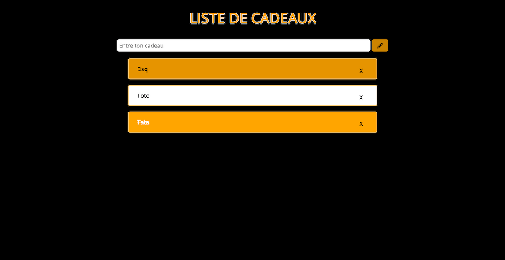

# Livraison 4 ToDoList JavaScript (dans le cadre d'un exercice pour la formation) niveau à 1 mois et demi sur 8mois de formation
To Do list project:

Découverte de JavaScript et toutes ses dificulté le but etait de crée une ToDoList uniquement en vanilla JS sans framework JS
ma plus grande source d'information et que je recommande vivement est le site : https://javascript.info/.

Les fonctionalités que j'ai ajouté :
 1. La suppression de la tâche 
 2. Voir si la tache est fini avec une couleur differente
 3. Que le cache de l'input se clear à chaque ajout
  
  >>En formation avec l'organisme Simplon et Yes We Web pour devenir un futur devellopeur Web

